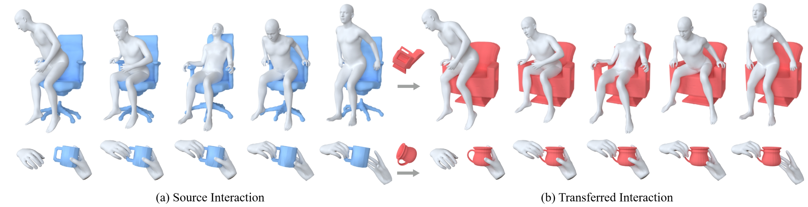

<div align="center">
<h2 align="center" style="font-size: 35px;">Spatial and Surface Correspondence Field for Interaction Transfer</h2>
<h3 align="center" style="font-size: 20px;">SIGGRAPH 2024</h3>

<a href="https://github.com/zzilch">Zeyu Huang</a>, <a href="https://github.com/Daisy-1227">Honghao Xu</a>, <a href="https://brotherhuang.github.io/">Haibin Huang</a>, <a href="http://chongyangma.com/">Chongyang Ma</a>, <a href="https://vcc.tech/~huihuang">Hui Huang</a>, <a href="https://csse.szu.edu.cn/staff/ruizhenhu/">Ruizhen Hu</a>



</div>


This repository provides code, data and pretrained models for **SSCF**.

[[Project Webpage](https://vcc.tech/research/2024/InterTransfer)]    | [[Paper](https://dl.acm.org/doi/10.1145/3658169
)]   

## Environment Setup

### Installation

1. Create a new conda env
```bash
conda create -n sscf python=3.9 cmake make compilers pybind11 eigen -c conda-forge
```
2. Install pyigl

```bash
pip install git+https://github.com/zilch/pyigl
# pip install git+https://gitee.com/zilch/pyigl
```

3. Install [`Pytorch`](https://pytorch.org/get-started/previous-versions/) and [`Pytorch3D`](https://github.com/facebookresearch/pytorch3d/blob/main/INSTALL.md) based on your cuda version. (Our `Pytorch` version is 2.4.0 and `cuda` version is 12.2)

```bash
conda install pytorch==2.4.0 torchvision==0.19.0 torchaudio==2.4.0 pytorch-cuda=12.1 -c pytorch -c nvidia
conda install pytorch3d -c pytorch3d
```

4. Install the human models with `smplx` and `mano`.


```bash
pip install smplx
pip install git+https://github.com/lixiny/manotorch.git
```

5. Install other dependencies.

```bash
pip install trimesh[all] pyvista[all] point-cloud-utils h5py scikit-learn cycpd chumpy scikit-image matplotlib imageio plotly opencv-python open3d warp-lang

pip install numpy==1.23.0
```

### Data Preparation

We directly provide the processed data and checkpoints, please download [them](https://drive.google.com/file/d/1BLWYU6UDPd2oeXVpuCoBjsYBXlm9fQ_d/view?usp=sharing) and organize them as following:

```
sscf/
└── data/
    ├── ckpts/
    ├── hoi/
    ├── human_model/
    ├── shapenet/
```

For details on data preprocessing, please refer to [preprocess_data](preprocess_data).

## Evaluation

### Human-chair Interaction
If you want to evaluate our model on human-chair interaction, please run:

```shell
python generate_chairs_interaction.py
```

### Hand-mug Interaction

If you want to evaluate our model on hand-mug interaction, please run:

```shell
python generate_mugs_interaction.py
```

### Reproduction of baselines

We also provide our reproduction code of other baselines, please refer to [baselines](baselines) for more details.

## Citation
If you find SSCF useful in your research, please cite our paper:
```
@article {huang_sig24,
  author = {Zeyu Huang and Honghao Xu and Haibin Huang and Chongyang Ma and Hui Huang and Ruizhen Hu},
  title = {Spatial and Surface Correspondence Field for Interaction Transfer},
  journal = {ACM Transactions on Graphics (Proc. of SIGGRAPH)},
  volume = {43},
  number = {4},
  issn = {0730-0301},
  url = {https://doi.org/10.1145/3658169},
  doi = {10.1145/3658169},
  year = {2024}
}
```

## Acknowledgment

We thank for the following excellent open source projects:

* [OakInk](https://github.com/oakink/OakInk)
* [DIF-Net](https://github.com/microsoft/DIF-Net)
* [NDF](https://github.com/anthonysimeonov/ndf_robot)
* [SMPLX](https://github.com/vchoutas/smplx)
* [MANO](https://github.com/lixiny/manotorch)